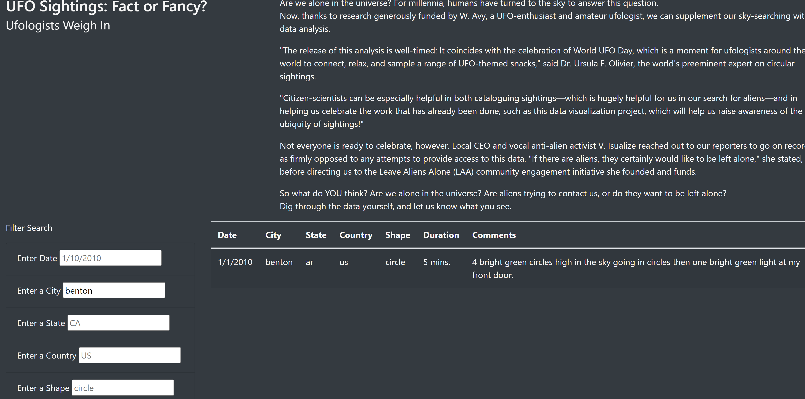

# UFOs By: David Matheny, Date:2/25/2022

# Overview of Project:
Dana’s webpage and dynamic table are working as intended, but she’d like to provide a more in-depth analysis of UFO sightings by allowing users to filter for multiple criteria at the same time. In addition to the date, you’ll add table filters for the city, state, country, and shape.

# Results:
Dana now has 5 different filters to go through the data with.  For example if she wanted to look at just the city of benon, CA, US on 1/10/2010 just circles she can, see below.

# Summary:
To be completely honest I dont think at present this solution is very good.  First I think all the search boxes should be dropdowns based on the data at hand that cascade.  This would allow them to see whats avalible instead of having to pick through the data.  Secondly I dont think pulling data from a flat file is very useful.  The data file would need to be updated on a schedule, it would be better to pull the data directly from a database.  Third, I think if youre looking to do reporting on the web or otherwise why not use Powerbi or tableau this would save you a tremendous amount of time on formatting etc.  But it was cool to use javascript to look behind the scenes a little. 